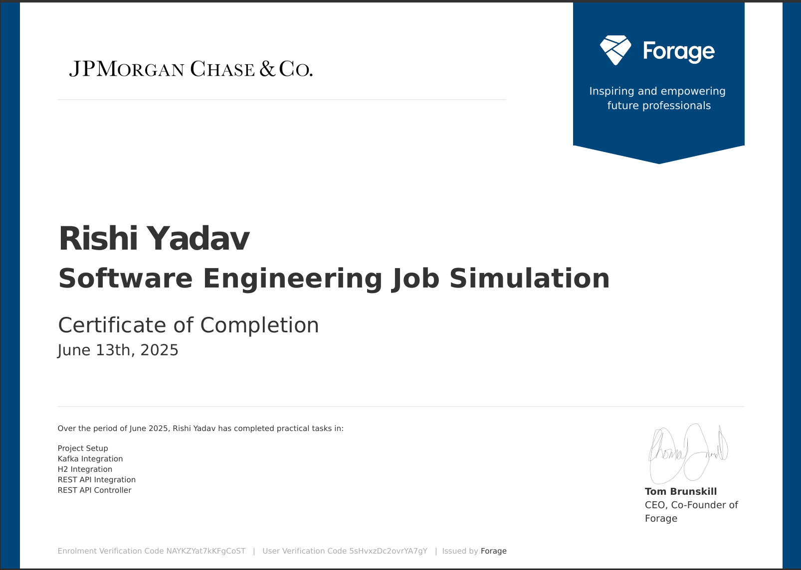

# Midas
Project repo for the JPMC Advanced Software Engineering Forage program
# 🏦 JPMorgan Chase Virtual Internship – Backend Engineering (via Forage)

**Author:** Rishi Yadav  
🎓 BTech CSE 3rd-Year Student

This repository contains five backend development tasks completed as part of the  
**JPMorgan Chase Software Engineering Virtual Experience Program**, hosted on **Forage**.  
The program simulated real-world engineering challenges and allowed me to build and deploy  
enterprise-grade backend components using modern technologies like **Spring Boot**, **Kafka**, and **REST APIs**.

---

## 📌 Internship Summary

🚀 **Just completed the JPMorgan Chase Software Engineering Virtual Experience Program!**  
📅 **Completed on:** June 13, 2025  
🕒 **Total Duration:** ~6 hours | Self-paced | 5 Practical Tasks  
📜 **Certificate:** [View Certificate](https://lnkd.in/g-Ch2cVV)  
🔗 **GitHub Repository:** [Project Code](https://lnkd.in/gxK929nj)

---

## 🛠️ Tech Stack Used

- Java 17
- Spring Boot
- Apache Kafka
- Spring Data JPA
- H2 In-Memory Database
- RESTful APIs
- Maven

---

## ✅ Tasks Completed

### ✔️ Task 1: Project Setup
- Initialized a Spring Boot project with Maven and Java 17
- Understood the structure and goals of the **Midas Core System**

### ✔️ Task 2: Kafka Integration
- Built a **Kafka consumer** using Spring Kafka
- Received and processed transactions asynchronously

### ✔️ Task 3: H2 Database Integration
- Persisted transaction data in an **H2 in-memory SQL database**
- Used **Spring Data JPA** to model entities and relationships

### ✔️ Task 4: External REST API Integration
- Integrated with an **external incentive API** using `RestTemplate`
- Retrieved dynamic incentive data for each transaction

### ✔️ Task 5: Balance API Controller
- Developed a **`/balance` REST endpoint** to expose user balances
- Followed Spring MVC patterns and secure coding practices

---

## 🧠 What I Learned

- How to structure scalable **microservices** using Spring Boot
- Event-driven design using **Kafka** for loosely coupled components
- Clean architecture and **REST API development**
- Hands-on experience with **JPA**, **Hibernate**, and **relational modeling**
- Efficient use of tools like **H2**, **Maven**, and `RestTemplate`

---

## 💬 Reflection

This virtual internship was more than a certificate — it offered **real-world backend engineering exposure**, helped solidify my system design skills, and added substantial value to my technical profile.  
It provided relevant talking points for interviews, especially those focused on **backend architecture**, **APIs**, and **event-driven systems**.

---

## 🙏 Acknowledgments

A huge thank you to **JPMorgan Chase & Co.** and **Forage** for offering this impactful, real-world simulation to students and aspiring developers worldwide!

---

📢 *If you're interested in backend engineering or preparing for interviews, I highly recommend enrolling in this virtual experience on [Forage](https://www.theforage.com/).*

## 📄 Certificate of Completion

This certificate serves as proof of my successful completion of the JPMorgan Chase Software Engineering Virtual Experience Program.

